# stm32-hal-devices

适配 STM32 HAL 库的常用外设/传感器模块，提供统一的配置入口与简单的使用接口。

****

**🔨 模块持续扩展，项目持续改进中...**

**⭐ 欢迎提出Issues和PR，如果这个项目对你有帮助，请给个 Star！**

## 📑 目录

- [📖 项目简介](#-项目简介)
- [📁 项目结构](#-项目结构)
- [🚀 快速开始](#-快速开始)
  - [1. 安装STM32CubeIDE](#1-安装stm32cubeide)
  - [2. 新建并配置工程](#2-新建并配置工程)
  - [3. 导入Devices库](#3-导入devices库)
- [⚙️ 模块配置](#️-模块配置)
  - [1. OLED 显示模块](#1-oled-显示模块)
  - [2. MPU6050 六轴传感器模块](#2-mpu6050-六轴传感器模块)
  - [3. TB6612 电机驱动模块](#3-tb6612-电机驱动模块)
  - [4. Encoder 编码器模块](#4-encoder-编码器模块)
  - [5. Serial 串口模块](#5-serial-串口模块)
  - [6. HCSR04 超声波测距模块](#6-hcsr04-超声波测距模块)
  - [7. Tracker 五路循迹模块](#7-tracker-五路循迹模块)
- [📧 联系方式](#-联系方式)

## 📖 项目简介

本项目为 STM32 HAL 库提供了一套通用的外设/传感器驱动模块。所有模块通过统一的 `config.h` 配置文件进行管理，支持模块化使能和硬件映射，方便在不同 STM32 项目中快速集成和使用。

## 📁 项目结构

```
stm32-hal-devices/
├── config.h                # 统一配置文件（硬件映射与模块使能）
├── OLED/                 	# I2C OLED 显示模块
├── MPU6050/                # MPU6050 六轴传感器模块
├── TB6612/                	# TB6612 双路电机驱动模块
├── Encoder/               	# 轮式霍尔AB编码器模块  
├── Serial/                 # Serial 串口模块
├── HCSR04/                 # HC-SR04 超声波测距模块
├── Tracker/                # 五路循迹传感器模块
├── images/
├── README.md              
└── LICENSE
```

## 🚀 快速开始

### 1. 安装 STM32CubeIDE

- 下载并安装：[STM32CubeIDE](https://www.st.com.cn/zh/development-tools/stm32cubeide.html)。

  **注意**：选择安装**1.19.0**版本的。

  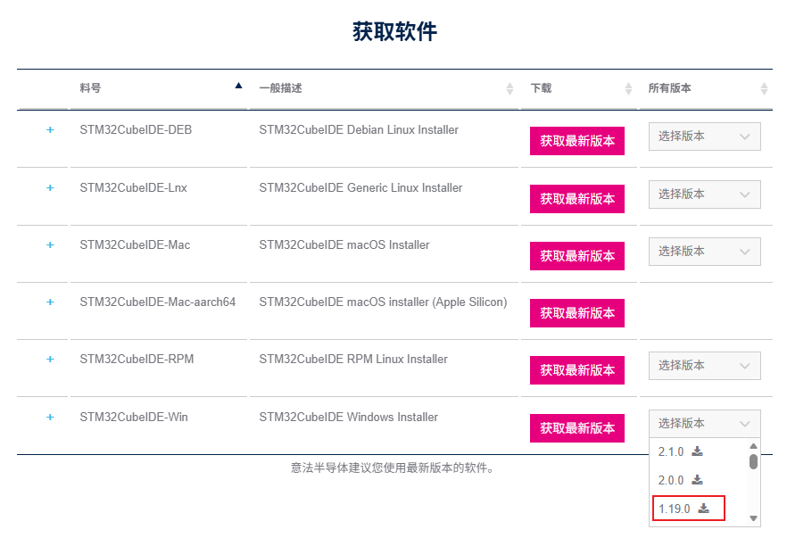

- 配置及汉化教程：[STM32CubeIDE配置及汉化教程](https://blog.csdn.net/c858845275/article/details/144321873)。

### 2. 新建并配置工程

- 选择 `文件` ->  `新建` -> `STM32 Project`。

- 选择芯片型号 `STM32F103C8T6`（以stm32f103c8t6为例），点击下一步。

  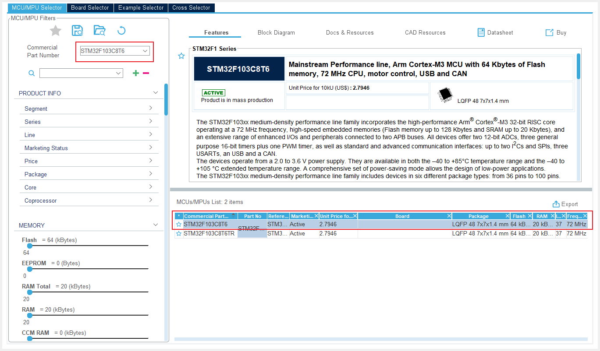

- 填写项目名称 `test`，其他选项保持默认，点击完成。

  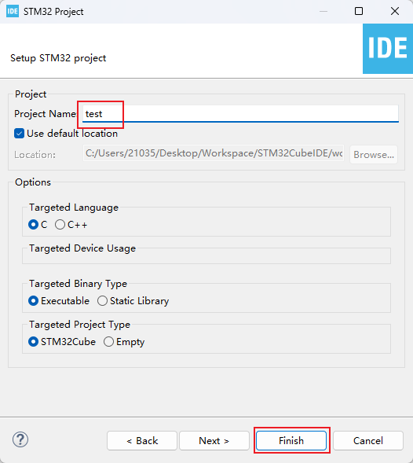

- 打开 `Pinout & Configuration` 选项卡：

  - 点击 `RCC`，将 `HSE` 设置为 `Cystal/Ceramic Resonator`。

    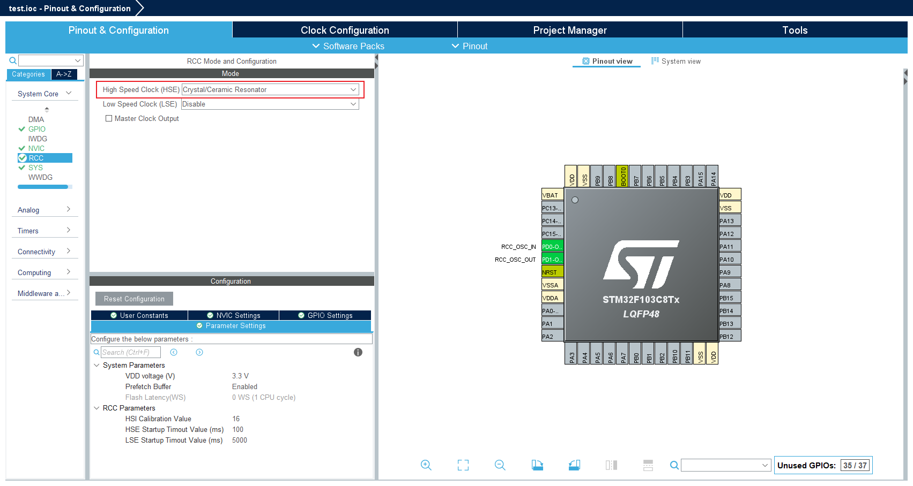

  - 点击 `SYS`，将 `DEBUG` 设置为 `Serial Wire`。

    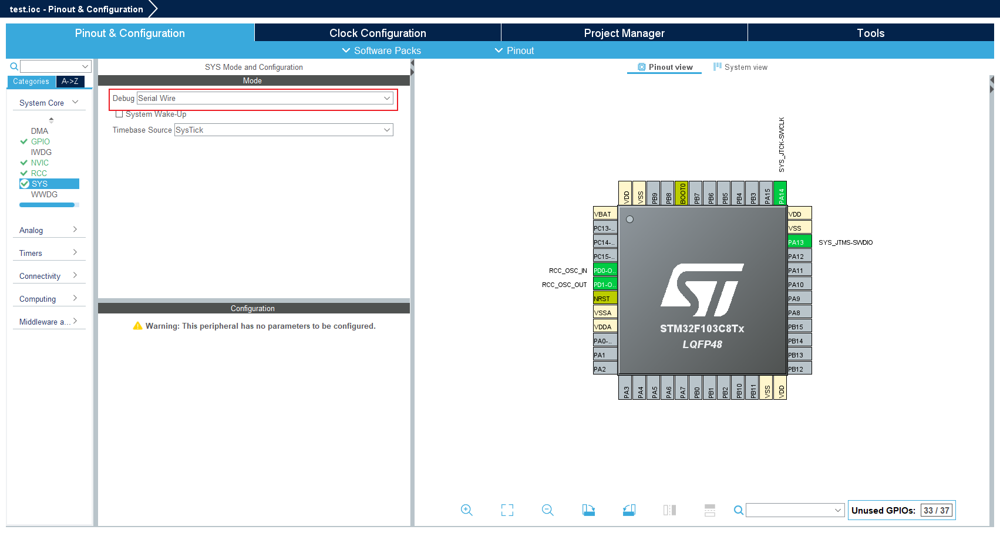

- 打开 `Clock Configuration` 选项卡：

  - 选择 `HSE` 频率为 `8MHz`。
  - 将 `SYSCLK` 设置为 `72MHz`。
    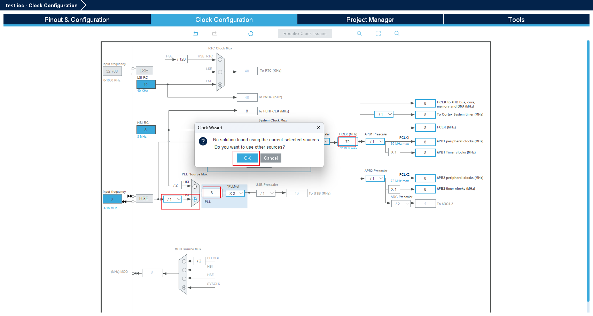

- 打开 `Project Manager` 选项卡，进入 `Code Generator` 选择框，勾选：

  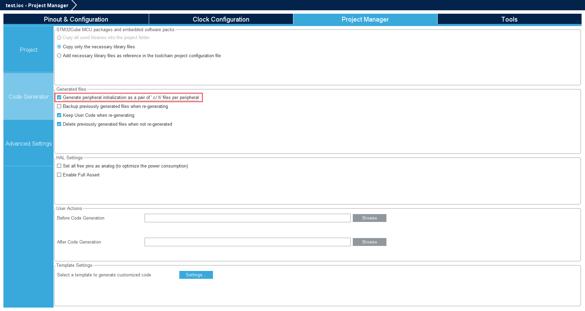

- 按 `Ctrl + S` 生成代码，点击上方工具栏中的🔨图标编译无报错则表示生成的工程没有问题。

  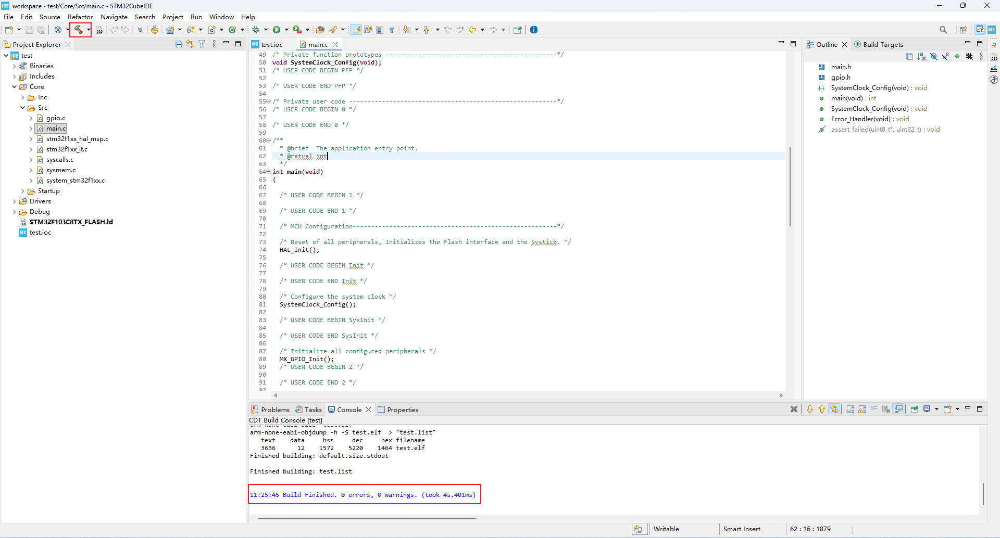

### 3. 导入 Devices 库

- 右键点击工程 -> 点击 `显示位置` -> 点击 `系统资源管理器`。

  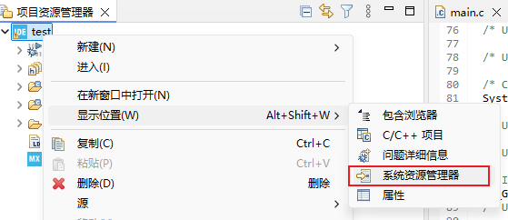

- 右键打开终端，输入以下命令克隆当前工程导入Devices库：

  ```bash
  git clone https://github.com/CaddonThaw/stm32-hal-devices.git Devices
  ```

  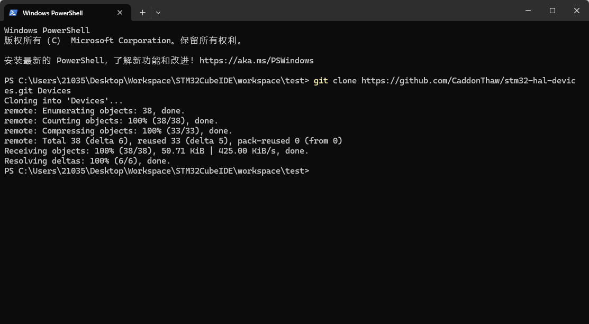

- 刷新工程，点击 `项目` -> 点击 `属性` -> 点击 `C/C++ 常规` -> 点击 `路径和符号` -> 在 `包含` 和 `源位置` 中添加Devices库路径。

  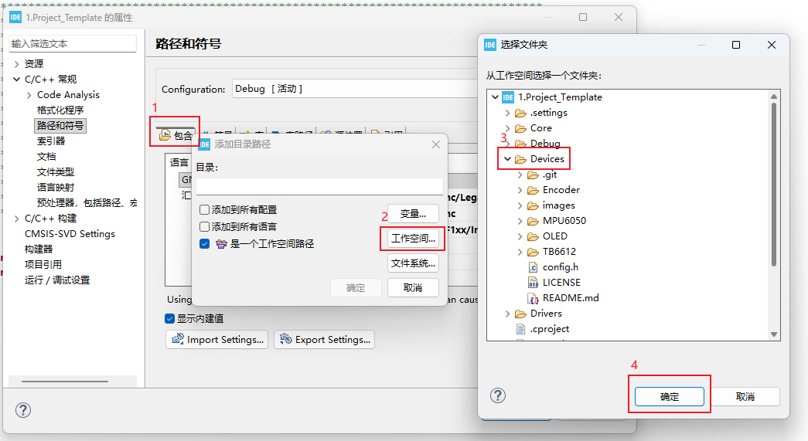

  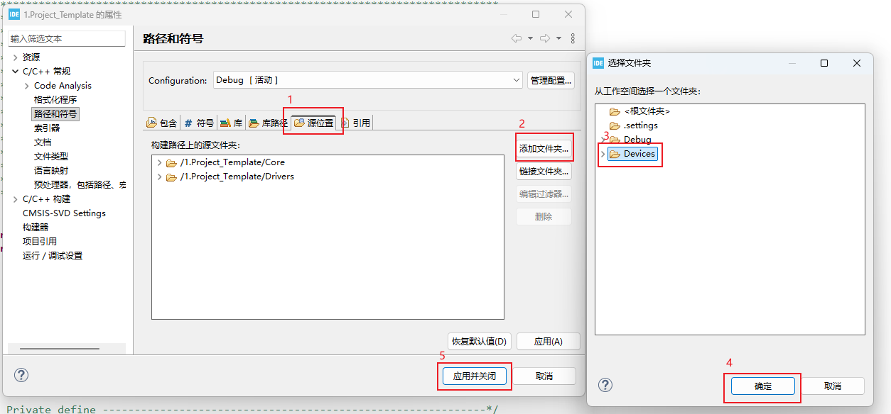

- 点击 `应用并关闭` -> 点击工具栏🔨图标编译无报错则成功导入Devices库。

## ⚙️ 模块配置

### 1. OLED 显示模块

支持4针脚 0.96 寸 I2C OLED 显示屏（SSD1306 控制器），使用软件模拟 I2C。

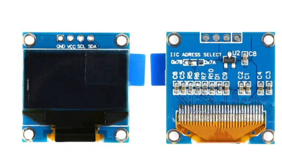

#### 硬件连接

| OLED引脚 | STM32引脚 | 说明 |
|---------|----------|------|
| VCC | 3.3V/5V | 电源 |
| GND | GND | 公共地 |
| SCL | GPIO输出（PB8） | I2C时钟线（软件模拟） |
| SDA | GPIO输出（PB9） | I2C数据线（软件模拟） |

#### CubeMX 配置

**添加路径：**

- 点击 `项目` -> 点击 `属性` -> 点击 `C/C++ 常规` -> 点击 `路径和符号` -> 在 `包含` 中添加 `Devices/OLED` 

  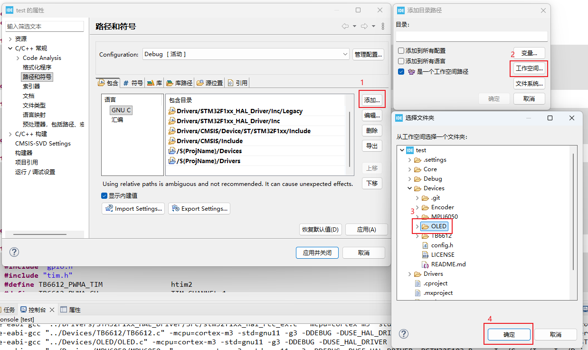

**GPIO配置：**

- 选择两个 GPIO 引脚（例如 PB8、PB9）

- 设置为 **GPIO_Output**

  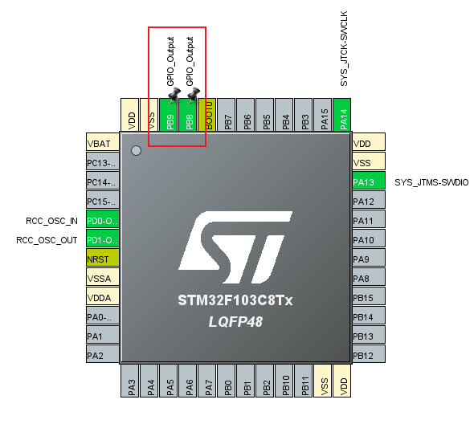

- GPIO output level：**Push-Pull**

- GPIO mode：**High**

- Maximum output speed：**High**

- User Label：SCL引脚设置为 **OLED_SCL** 、SDA引脚设置为 **OLED_SDA**

- 其他选项保持默认配置

​	

​	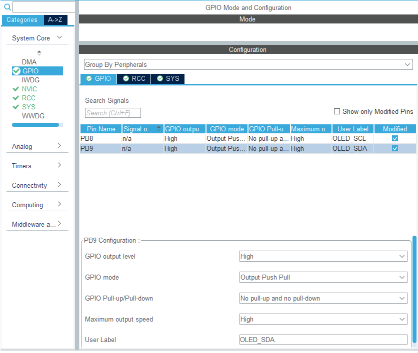

#### config.h 配置

```c
// 使能OLED模块
#define DEVICE_OLED     1
#if DEVICE_OLED 
    #include "gpio.h"
    // GPIO控制宏（CubeMX生成的引脚名称）
    #define OLED_W_SCL(x)           HAL_GPIO_WritePin(OLED_SCL_GPIO_Port, OLED_SCL_Pin, (x))
    #define OLED_W_SDA(x)           HAL_GPIO_WritePin(OLED_SDA_GPIO_Port, OLED_SDA_Pin, (x))
#endif
```

#### API 接口

```c
void OLED_Init(void);                          // 初始化OLED
void OLED_Clear(void);                         // 清屏

// 显示字符和字符串（行：1-4，列：1-16）
void OLED_ShowChar(uint8_t Line, uint8_t Column, char Char);
void OLED_ShowString(uint8_t Line, uint8_t Column, char *String);

// 显示数字
void OLED_ShowNum(uint8_t Line, uint8_t Column, uint32_t Number, uint8_t Length);
void OLED_ShowSignedNum(uint8_t Line, uint8_t Column, int32_t Number, uint8_t Length);
void OLED_ShowHexNum(uint8_t Line, uint8_t Column, uint32_t Number, uint8_t Length);
void OLED_ShowBinNum(uint8_t Line, uint8_t Column, uint32_t Number, uint8_t Length);

// 显示浮点数
void OLED_ShowSignedFloat(uint8_t line, uint8_t column, float value, uint8_t intWidth);
```

#### 使用示例

```c
#include "OLED.h"

int main(void)
{
    OLED_Init();
    OLED_Clear();

    // 第1行显示标题
    OLED_ShowString(1, 1, "STM32 HAL");

    // 第2行显示整数
    OLED_ShowString(2, 1, "Count:");
    OLED_ShowNum(2, 8, 12345, 5);

    // 第3行显示浮点数
    float speed = -12.345f;
    OLED_ShowString(3, 1, "Speed:");
    OLED_ShowSignedFloat(3, 8, speed, 3);  // 显示为 "-12.34"

    // 第4行显示十六进制
    OLED_ShowString(4, 1, "ID:0x");
    OLED_ShowHexNum(4, 6, 0x68, 2);

    while (1)
    {
        HAL_Delay(10);
    }
}
```

---

### 2. MPU6050 六轴传感器模块

支持三轴陀螺仪和三轴加速度计的 MPU6050 传感器，支持 DMP（数字运动处理器）进行姿态解算，使用硬件I2C。

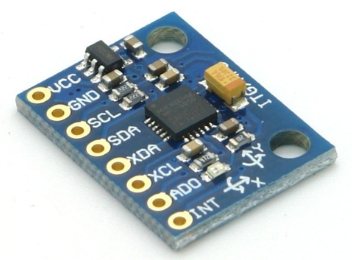

#### 硬件连接

| MPU6050引脚 | STM32引脚 | 说明 |
|------------|----------|------|
| VCC | 3.3V | 电源（注意：不能接5V） |
| GND | GND | 公共地 |
| SCL | I2C2_SCL（PB10） | I2C时钟线 |
| SDA | I2C2_SDA（PB11） | I2C数据线 |

#### CubeMX 配置

**添加路径：**

- 点击 `项目` -> 点击 `属性` -> 点击 `C/C++ 常规` -> 点击 `路径和符号` -> 在 `包含` 中添加 `Devices/MPU6050`

  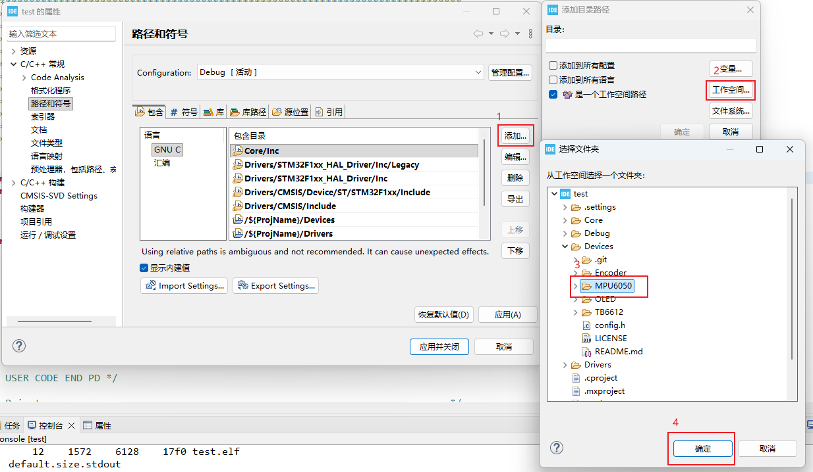

**I2C配置：**

- 选择两个 I2C 引脚（例如PB10、PB11）

- 分别设置为 **I2C2_SCL** 和 **I2C2_SDA**

  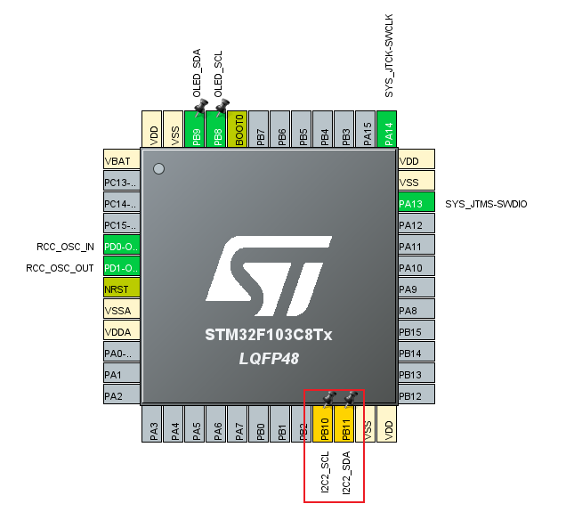

- 找到 **I2C2** 使能 **I2C** 模式

- I2C Speed Mode 设置为 **Standard Mode**（100kHz）或 **Fast Mode**（400kHz）

- 其他选项保持默认配置

​	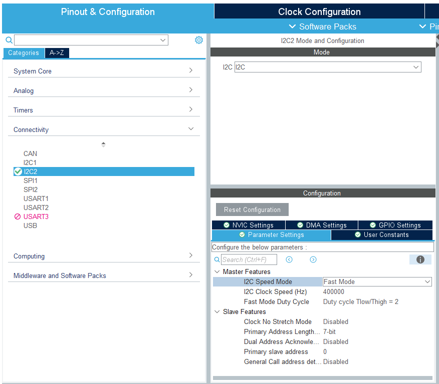

#### config.h 配置

```c
// 使能MPU6050模块
#define DEVICE_MPU6050  1
#if DEVICE_MPU6050
    #include "i2c.h"
    // I2C接口
    #define MPU6050_I2C             hi2c2
#endif
```

#### API 接口

```c
void MPU6050_Init(void);                       // 基础初始化（寄存器配置）
uint8_t MPU6050_GetID(void);                   // 获取设备ID（正常为0x68）

// 原始数据读取
void MPU6050_GetData(int16_t *AccX, int16_t *AccY, int16_t *AccZ,
                     int16_t *GyroX, int16_t *GyroY, int16_t *GyroZ);

// DMP姿态解算
int MPU6050_DMP_Init(void);                    // DMP初始化（返回0成功）
int MPU6050_DMP_ReadEuler(float *pitchDeg, float *rollDeg, float *yawDeg); // 读取欧拉角（度）
float MPU6050_DMP_GetROSGyroz(void);           // 获取Z轴角速度（rad/s，ROS格式）
```

#### 使用示例

```c
#include "MPU6050.h"
#include "OLED.h"  

int main(void)
{
    // 初始化OLED用于显示
    OLED_Init();
    OLED_Clear();
    
    // 初始化MPU6050
    MPU6050_Init();
    uint8_t id = MPU6050_GetID();
    
    OLED_ShowString(1, 1, "MPU ID:");
    OLED_ShowHexNum(1, 9, id, 2);  // 应显示0x68
    
    while (1)
    {
        int16_t ax, ay, az, gx, gy, gz;
        MPU6050_GetData(&ax, &ay, &az, &gx, &gy, &gz);
        
        // 显示加速度数据
        OLED_ShowString(2, 1, "Acc:");
        OLED_ShowSignedNum(2, 6, ax, 5);
        
        // 显示陀螺仪数据
        OLED_ShowString(3, 1, "Gyr:");
        OLED_ShowSignedNum(3, 6, gz, 5);
        
        HAL_Delay(100);
    }
}

// 方式2：使用DMP姿态解算
int main(void)
{
    OLED_Init();
    OLED_Clear();
    
    // 初始化MPU6050 DMP
    while (MPU6050_DMP_Init());
    OLED_ShowString(1, 1, "DMP OK");
        
    while (1)
    {
        float pitch, roll, yaw;
        if (MPU6050_DMP_ReadEuler(&pitch, &roll, &yaw) == 0)
        {
            OLED_ShowString(2, 1, "P:");
            OLED_ShowSignedFloat(2, 4, pitch, 3);

            OLED_ShowString(3, 1, "R:");
            OLED_ShowSignedFloat(3, 4, roll, 3);

            OLED_ShowString(4, 1, "Y:");
            OLED_ShowSignedFloat(4, 4, yaw, 3);
        }

        HAL_Delay(50);
    }
}
```

---

### 3. TB6612 电机驱动模块

支持双路直流电机驱动的 TB6612FNG 芯片，支持 PWM 调速和方向控制。

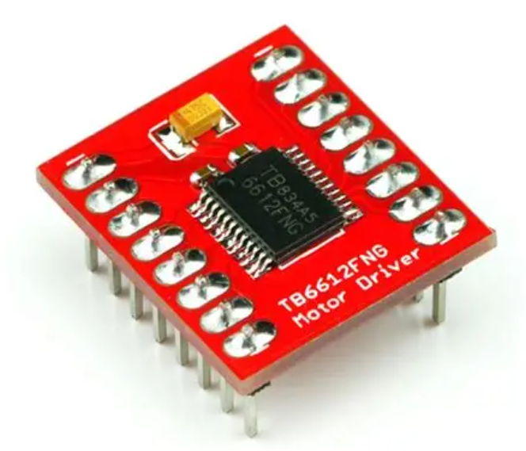

#### 硬件连接

| TB6612引脚 | STM32引脚 | 说明 |
|-----------|----------|------|
| PWMA | TIM2_CH1（PA0） | 电机A的PWM信号 |
| AIN1 | GPIO输出（PA4） | 电机A方向控制1 |
| AIN2 | GPIO输出（PA5） | 电机A方向控制2 |
| PWMB | TIM2_CH2（PA1） | 电机B的PWM信号 |
| BIN1 | GPIO输出（PA11） | 电机B方向控制1 |
| BIN2 | GPIO输出（PA12） | 电机B方向控制2 |
| VM | 电机电源 | 电机驱动电压 |
| VCC | 3.3V/5V | 逻辑电平 |
| GND | GND | 公共地 |

#### CubeMX 配置

**添加路径：**

- 点击 `项目` -> 点击 `属性` -> 点击 `C/C++ 常规` -> 点击 `路径和符号` -> 在 `包含` 中添加 `Devices/TB6612`

  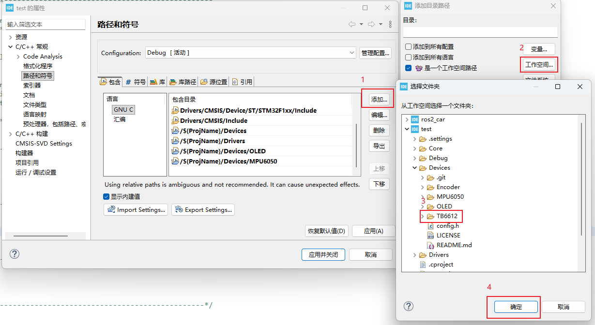

**定时器配置：**

- 选择两个定时器通道引脚（例如PA0、PA1）用于PWM输出

- 分别设置为 **TIM2_CH1** 和 **TIM2_CH2**

  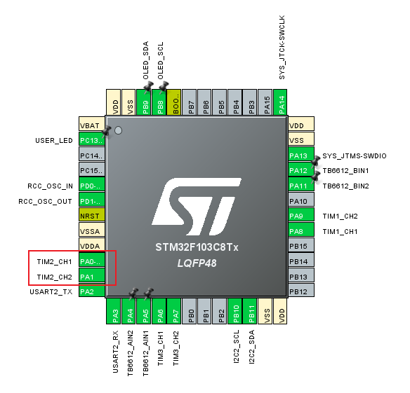

- 找到 **TIM2** 将Channel 1 和 Channel 2 设置为 **PWM Generation CHx**

- Prescaler (PSC)：**0**（不分频 频率为72M / 1 / 7200 = 1000Hz）

- Counter Mode：**Up**

- Counter Period (ARR)：**7200 - 1**（最大占空比为7200）

- 其他选项保持默认配置

  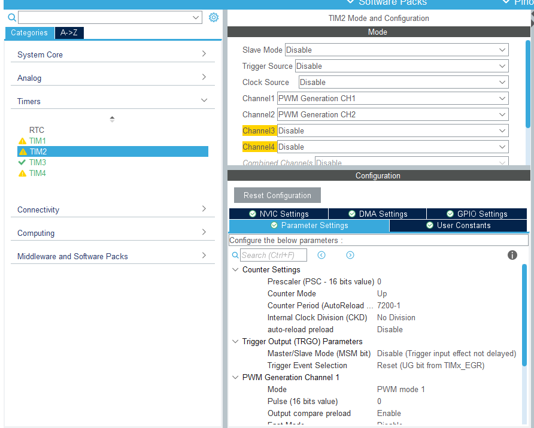

**GPIO配置：**

- 选择 4 个 GPIO 引脚（例如 PA4、PA5、PA11、PA12）用于方向控制

- 设置为 **GPIO_Output**

  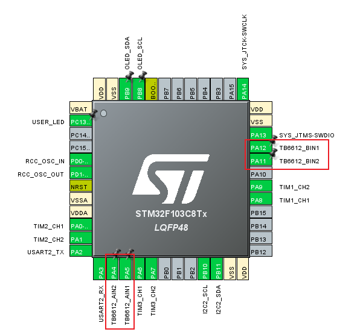

- GPIO output level：**Low**

- GPIO mode：**Push Pull**

- GPIO Pull-up/Pull-down：**No pull-up and no pull-down**

- Maximum output speed：**Low**

- User Label：分别设置为 **TB6612_AIN1**、**TB6612_AIN2**、**TB6612_BIN1**、**TB6612_BIN2**

- 其他选项保持默认配置

  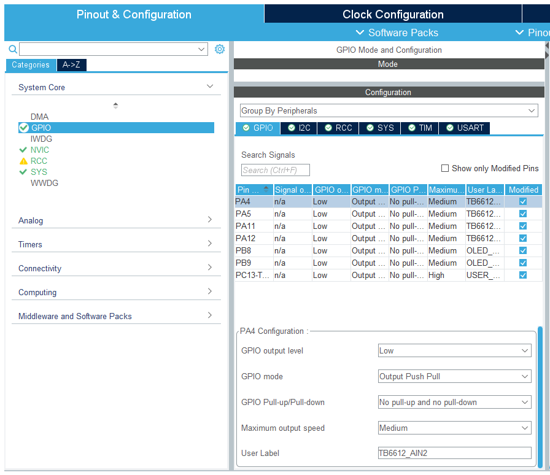

#### config.h 配置

```c
// 使能TB6612模块
#define DEVICE_TB6612 1
#if DEVICE_TB6612
    #include "gpio.h"
    #include "tim.h"    
    // PWM定时器和通道
    #define TB6612_PWMA_TIM         htim2
    #define TB6612_PWMA_CH          TIM_CHANNEL_1
    #define TB6612_PWMB_TIM         htim2
    #define TB6612_PWMB_CH          TIM_CHANNEL_2
    // 电机方向修正（1为正向，-1为反向）
    #define TB6612_DIRA             1
    #define TB6612_DIRB             1
    // GPIO控制宏（CubeMX生成的引脚名称）
    #define AIN1(x)                 HAL_GPIO_WritePin(TB6612_AIN1_GPIO_Port, TB6612_AIN1_Pin, (x))
    #define AIN2(x)                 HAL_GPIO_WritePin(TB6612_AIN2_GPIO_Port, TB6612_AIN2_Pin, (x))
    #define BIN1(x)                 HAL_GPIO_WritePin(TB6612_BIN1_GPIO_Port, TB6612_BIN1_Pin, (x))
    #define BIN2(x)                 HAL_GPIO_WritePin(TB6612_BIN2_GPIO_Port, TB6612_BIN2_Pin, (x))
#endif
```

#### API 接口

```c
void TB6612_Init(void);                        	// 初始化（启动PWM）
void TB6612_Motor(int16_t motora, int16_t motorb); // 控制电机（正值正转，负值反转）
```

#### 使用示例

```c
#include "TB6612.h"
#include "OLED.h"  

int main(void)
{
    // 初始化TB6612
    TB6612_Init();
    
    // 初始化OLED显示
    OLED_Init();
    OLED_Clear();
    OLED_ShowString(1, 1, "TB6612 Test");
    
    while (1)
    {
        // 前进 - 两个电机都以500的速度正转（范围：-999~999）
        OLED_ShowString(2, 1, "Forward     ");
        TB6612_Motor(500, 500);
        HAL_Delay(2000);
        
        // 停止
        OLED_ShowString(2, 1, "Stop        ");
        TB6612_Motor(0, 0);
        HAL_Delay(1000);
        
        // 后退
        OLED_ShowString(2, 1, "Backward    ");
        TB6612_Motor(-500, -500);
        HAL_Delay(2000);
        
        // 停止
        TB6612_Motor(0, 0);
        HAL_Delay(1000);
        
        // 左转 - 左电机反转，右电机正转
        OLED_ShowString(2, 1, "Turn Left   ");
        TB6612_Motor(-300, 300);
        HAL_Delay(1000);
        
        // 右转 - 左电机正转，右电机反转
        OLED_ShowString(2, 1, "Turn Right  ");
        TB6612_Motor(300, -300);
        HAL_Delay(1000);
        
        // 停止
        TB6612_Motor(0, 0);
        HAL_Delay(1000);
    }
}
```

---

### 4. Encoder 编码器模块

支持两个轮式霍尔编码器速度读取，使用定时器的编码器模式。

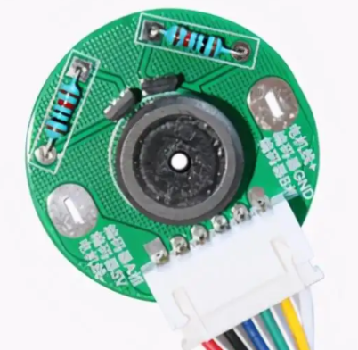

#### 硬件连接

| 编码器引脚 | STM32引脚 | 说明 |
|-----------|----------|------|
| A相（左轮） | TIM3_CH1（PA6） | 编码器A相信号 |
| B相（左轮） | TIM3_CH2（PA7） | 编码器B相信号 |
| A相（右轮） | TIM1_CH1（PA8） | 编码器A相信号 |
| B相（右轮） | TIM1_CH2（PA9） | 编码器B相信号 |
| VCC | 3.3V/5V | 电源 |
| GND | GND | 公共地 |

#### CubeMX 配置

**添加路径：**

- 点击 `项目` -> 点击 `属性` -> 点击 `C/C++ 常规` -> 点击 `路径和符号` -> 在 `包含` 中添加 `Devices/Encoder`

  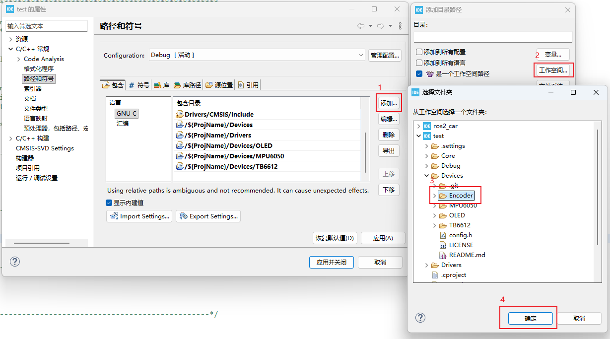

**定时器配置：**

- 选择两个不同的定时器的通道1和通道2引脚（只有定时器的通道1和通道2才能设置为编码器模式，例如A6、A7、A8、A9）用于编码器模式

- 分别设置为 **TIMx-CH1** 和 **TIMx-CH2**

  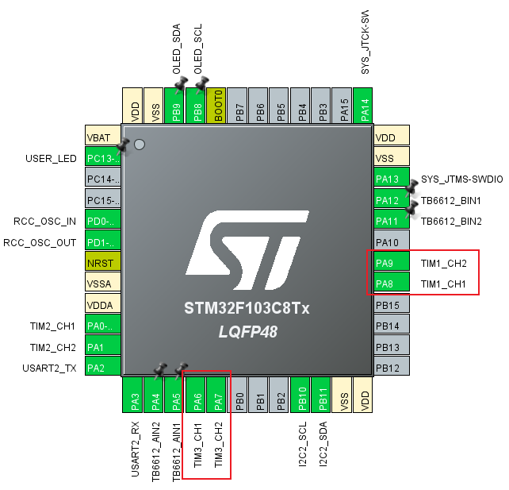

- 找到 **TIM1** 和 **TIM3** 设置 Combined Channels 为 **Encoder Mode**

- Prescaler (PSC)：**0**（不分频）

- Counter Period (ARR)：**65535**

- Encoder Mode：**Encoder Mode TI1 and TI2**（AB相四倍频）

- Polarity：**Rising Edge**

- 其他选项保持默认配置

  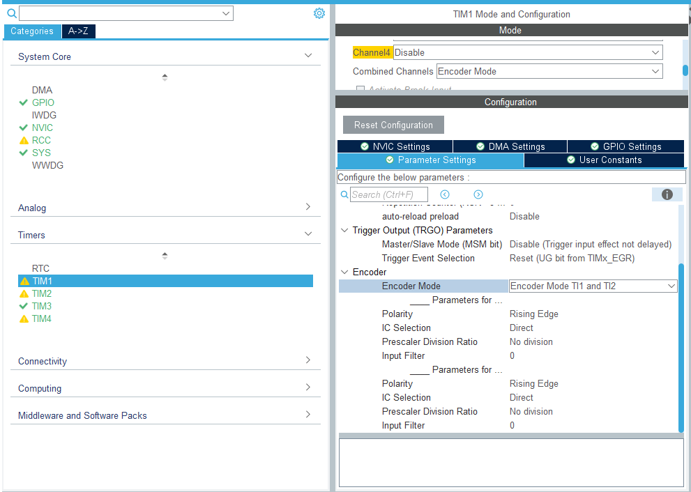

#### config.h 配置

```c
// 使能编码器模块
#define DEVICE_ENCODER  1
#if DEVICE_ENCODER
    #include "tim.h"
    // 编码器定时器
    #define Encoder_Left            htim3
    #define Encoder_Right           htim1
    // 机械参数
    #define ENCODER_WHEEL_DIAMETER  0.065f      // 轮径（米）
    #define ENCODER_PULSE_PER_REV   1470.0f     // 编码器每转一圈的脉冲数
    #define ENCODER_PI              3.1415926f
#endif
```

#### API 接口

```c
void Encoder_Init(void);                       // 初始化（启动编码器）
void Encoder_Read(float *left, float *right);  // 读取左右轮速度（m/s）
```

#### 使用示例

```c
#include "Encoder.h"
#include "OLED.h" 

float left_speed, right_speed;

int main(void)
{
    // 初始化编码器
    Encoder_Init();
    
    // 初始化OLED显示
    OLED_Init();
    OLED_Clear();
    OLED_ShowString(1, 1, "Encoder Test");
    
    while (1)
    {
        Encoder_Read(&left_speed, &right_speed);
        
        // 显示左右轮速度
        OLED_ShowString(2, 1, "L:");
        OLED_ShowSignedFloat(2, 4, left_speed, 3);
        OLED_ShowString(2, 12, "m/s");
        
        OLED_ShowString(3, 1, "R:");
        OLED_ShowSignedFloat(3, 4, right_speed, 3);
        OLED_ShowString(3, 12, "m/s");
        
        HAL_Delay(10);
    }
}
```

---

### 5. Serial 串口模块

支持多路 USART 串口，基于结构体实例管理，每路串口独立互不干扰。

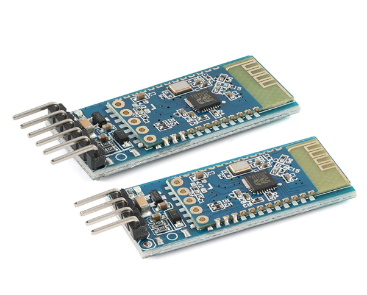

#### 硬件连接

| 串口引脚 | STM32引脚         | 说明         |
| -------- | ----------------- | ------------ |
| RXD      | USART3_TX（PB10） | 串口接收引脚 |
| TXD      | USART3_RX（PB11） | 串口发送引脚 |
| VCC      | 5V                | 电源         |
| GND      | GND               | 公共地       |

#### **CubeMX 配置**

**添加路径：**

- 点击 `项目` -> 点击 `属性` -> 点击 `C/C++ 常规` -> 点击 `路径和符号` -> 在 `包含` 中添加 `Devices/Serial`

  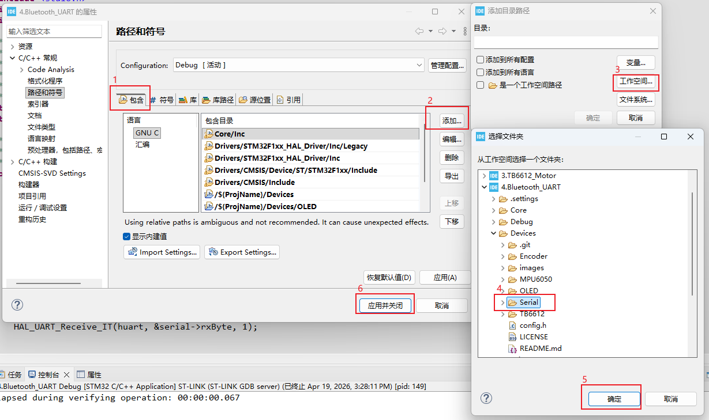

**USART 配置：**

- 选择两个串口引脚（例如PB10、PB11）用于串口发送和接收

- 分别设置为 **USART3_TX** 和 **USART3_RX**

  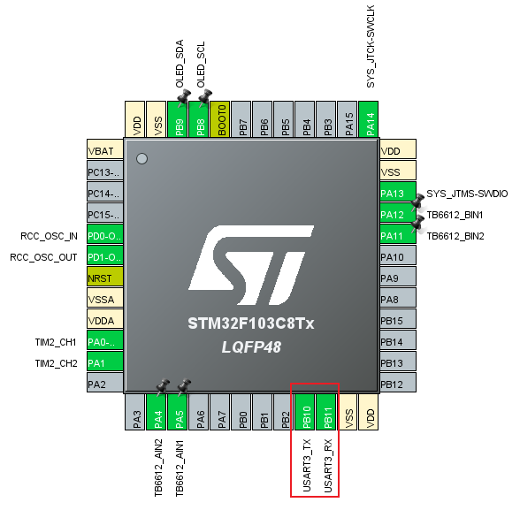

- 找到 **USART3**，将 Mode 设置为 **Asynchronous**

- Baud Rate：**115200**

- Word Length：**8 Bits**、Parity：**None**、Stop Bits：**1**

- 进入 **NVIC Settings**，勾选 **USART3 global interrupt**（开启接收中断）

- 其他选项保持默认配置

  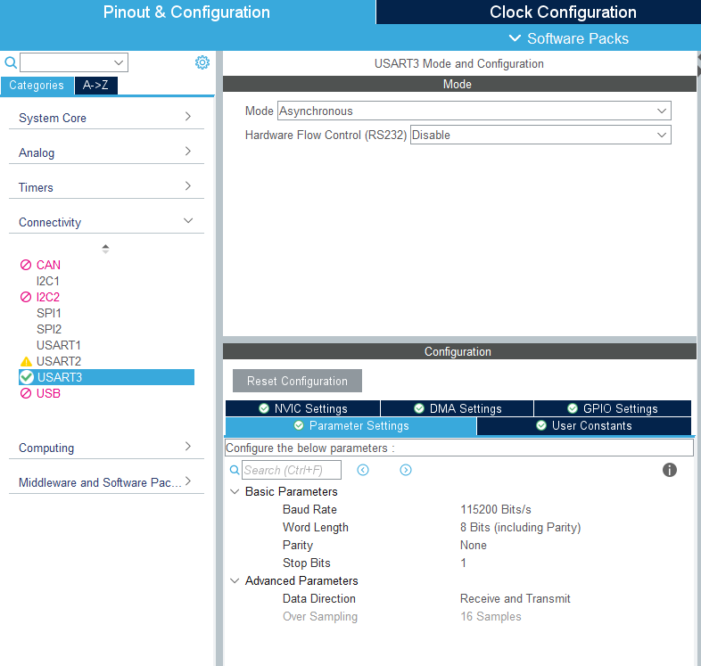

#### config.h 配置

```c
// 使能 Serial 模块
#define DEVICE_SERIAL   1
#if DEVICE_SERIAL
    #include "usart.h"
    #define SERIAL_NUMS     3   // 最多同时使用的串口数量
#endif
```

#### API 接口

```c
void Serial_Init(Serial *serial, UART_HandleTypeDef *huart); 	// 初始化串口实例并启动中断接收
void Serial_Printf(Serial *serial, const char *fmt, ...); 		// 格式化发送字符串（类 printf，阻塞直到发送完成）
bool Serial_Received(Serial *serial); 							// 查询是否收到新字节
unsigned char Serial_Read(Serial *serial); 						// 收到的字节
```

#### 使用示例

```c
#include "Serial.h"

// 声明串口实例（全局）
Serial Serial1;
Serial Serial2;

int main(void)
{
    // 在 HAL_Init 和 MX_USARTx_UART_Init 之后初始化
    Serial_Init(&Serial1, &huart1);
    Serial_Init(&Serial2, &huart2);

    Serial_Printf(&Serial1, "Hello from USART1\r\n");
    Serial_Printf(&Serial2, "Hello from USART2\r\n");

    while (1)
    {
        // 判断 Serial1 是否收到新字节
        if (Serial_Received(&Serial1))
        {
            unsigned char byte = Serial_Read(&Serial1);
            // 将收到的字节回显
            Serial_Printf(&Serial1, "Recv: 0x%02X\r\n", byte);
        }

        // 判断 Serial2 是否收到新字节
        if (Serial_Received(&Serial2))
        {
            unsigned char byte = Serial_Read(&Serial2);
            Serial_Printf(&Serial2, "Recv: 0x%02X\r\n", byte);
        }
    }
}
```

> **注意**：Serial 库内部已实现 `HAL_UART_RxCpltCallback`（覆盖 HAL 弱定义）。  
> 若项目中其他地方也需要该回调，请删除 Serial.c 中的 `HAL_UART_RxCpltCallback`，在自定义回调中手动调用本库内部逻辑。

---

### 6. HCSR04 超声波测距模块

支持 HC-SR04 超声波测距传感器，返回以毫米（mm）为单位的距离。

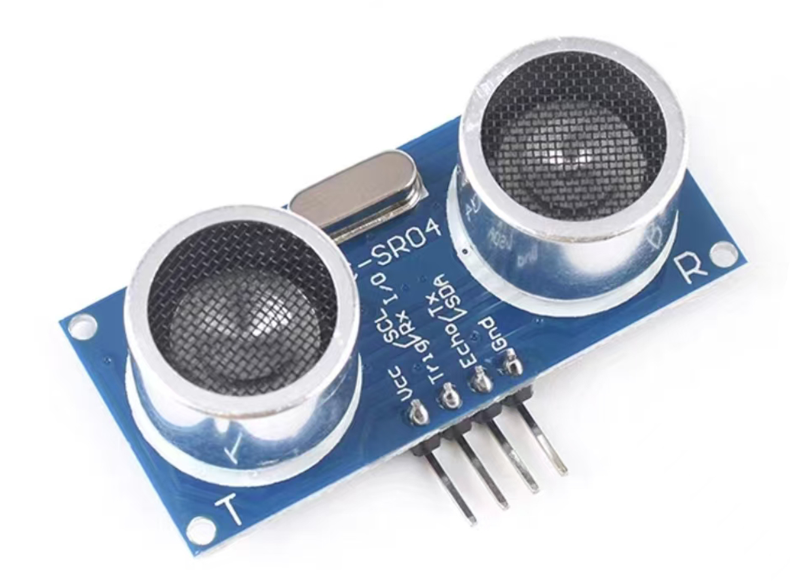

#### 硬件连接

| HCSR04 引脚 | STM32 引脚 | 说明 |
|------------|-----------|------|
| VCC | 5V | 电源（注意：需要 5V 供电） |
| GND | GND | 公共地 |
| Trig | GPIO 输出（PB4） | 触发引脚，输出 ≥10 µs 高电平脉冲 |
| Echo | GPIO 输入（PB3） | 回波引脚，高电平宽度对应往返时间 |

#### CubeMX 配置

**添加路径：**

- 点击 `项目` -> 点击 `属性` -> 点击 `C/C++ 常规` -> 点击 `路径和符号` -> 在 `包含` 中添加 `Devices/HCSR04`

  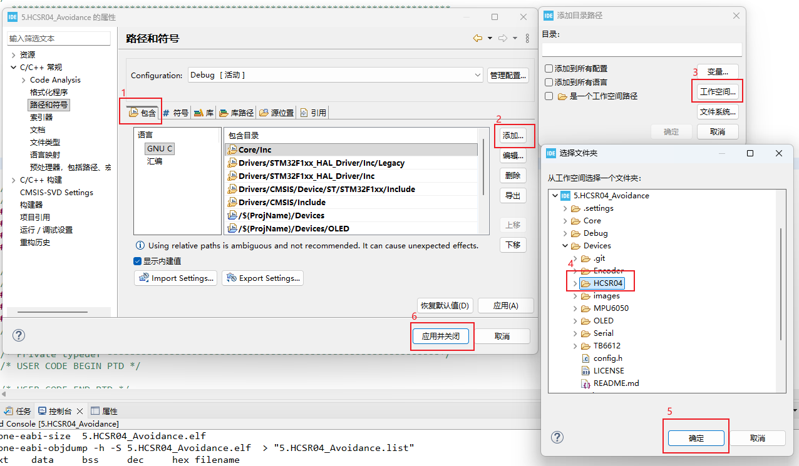

**GPIO 配置：**

- 选择一个 GPIO 引脚（如 PB4）设置为 **GPIO_Output**，User Label 设置为 **HCSR04_TRIG**

- 选择另一个 GPIO 引脚（如 PB3）设置为 **GPIO_Input**，User Label 设置为 **HCSR04_ECHO**

  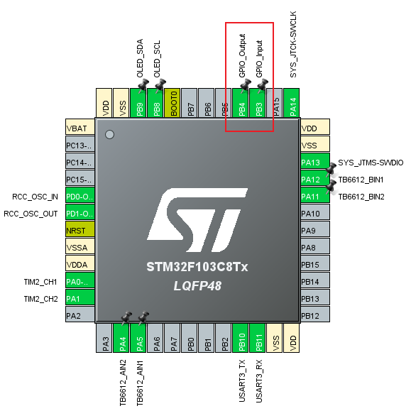

- Trig 引脚：GPIO output level **Low**、GPIO mode **Push Pull**、Speed **Low**

- Echo 引脚：GPIO Pull-up/Pull-down **No pull-up and no pull-down**

  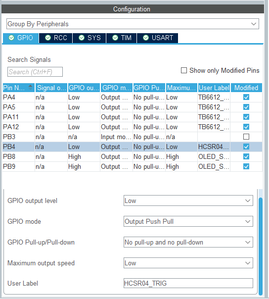

  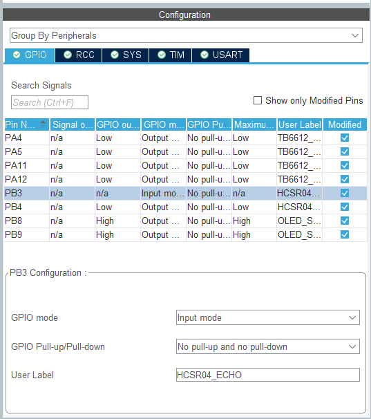

**定时器配置：**

- 选择一个空闲的通用定时器（如 TIM4），设置 **Internal Clock** 模式

- Prescaler (PSC)：**71**（72 MHz / 72 = 1 MHz 定时器时钟）

- Counter Mode：**Up**

- Counter Period (ARR)：**9**（溢出周期 = 10 / 1 MHz = 10 µs）

- 进入 **NVIC Settings**，勾选 **TIMx global interrupt**（开启溢出中断）

  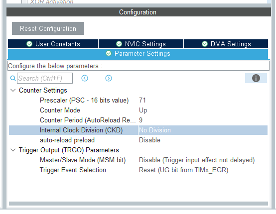

- 其他选项保持默认配置

#### config.h 配置

```c
// 使能 HCSR04 模块
#define DEVICE_HCSR04   1
#if DEVICE_HCSR04
    #include "tim.h"
    #include "gpio.h"
    // 计时定时器
    #define HCSR04_TIM              htim4
    // GPIO 控制宏（CubeMX 生成的引脚名称）
    #define HCSR04_TRIG(x)          HAL_GPIO_WritePin(HCSR04_TRIG_GPIO_Port, HCSR04_TRIG_Pin, (x))
    #define HCSR04_ECHO             HAL_GPIO_ReadPin(HCSR04_ECHO_GPIO_Port, HCSR04_ECHO_Pin)
#endif
```

#### API 接口

```c
void    HCSR04_Init(void);   // 初始化（使能 DWT 微秒延时并启动定时器中断）
int16_t HCSR04_Read(void);   // 阻塞式测距，返回距离（mm），超出量程返回 0
```

#### 使用示例

```c
#include "HCSR04.h"
#include "OLED.h" 

int main(void)
{
    // 初始化 HCSR04
    HCSR04_Init();

    // 初始化 OLED 显示
    OLED_Init();
    OLED_Clear();
    OLED_ShowString(1, 1, "HCSR04 Test");

    while (1)
    {
        int16_t dist = HCSR04_Read();

        OLED_ShowString(2, 1, "Dist:");
        if (dist > 0)
        {
            OLED_ShowNum(2, 7, (uint32_t)dist, 4);
            OLED_ShowString(2, 12, "mm");
        }
        else
        {
            OLED_ShowString(2, 7, "---- ");
        }

        HAL_Delay(60);
    }
}
```

> **注意**：HCSR04 库内部已实现 `HAL_TIM_PeriodElapsedCallback`（覆盖 HAL 弱定义）。
> 若项目中其他地方也需要该回调，请删除 HCSR04.c 中的 `HAL_TIM_PeriodElapsedCallback`，在自定义回调中手动调用本库内部逻辑。

---

### 7. Tracker 五路灰度循迹模块

支持五路灰度循迹传感器，传感器检测到黑线时输出高电平（返回 1），脱离黑线时输出低电平（返回 0），返回偏差值供 PID 等控制算法使用。

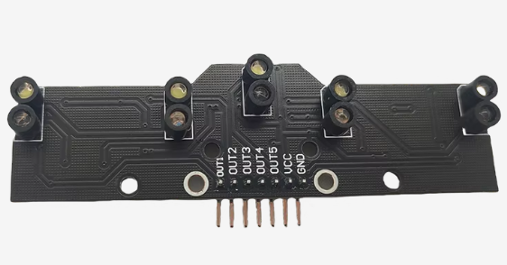

#### 硬件连接

| 循迹引脚 | STM32引脚 | 说明 |
|---------|----------|------|
| L2（最左） | GPIO输入（PA15） | 左侧第2路 |
| L1 | GPIO输入（PB15） | 左侧第1路 |
| M（中间） | GPIO输入（PB14） | 中间路 |
| R1 | GPIO输入（PB13） | 右侧第1路 |
| R2（最右） | GPIO输入（PB12） | 右侧第2路 |
| VCC | 5V               | 电源 |
| GND | GND | 公共地 |

#### CubeMX 配置

**添加路径：**

- 点击 `项目` -> 点击 `属性` -> 点击 `C/C++ 常规` -> 点击 `路径和符号` -> 在 `包含` 中添加 `Devices/Tracker`

  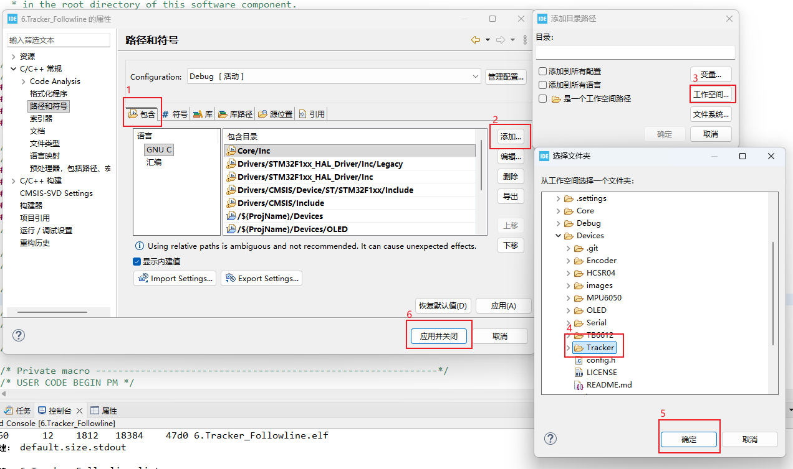

**GPIO 配置：**

- 选择 5 个 GPIO 引脚（例如 PB12、PB13、PB14、PB15、PA15）设置为 **GPIO_Input**

  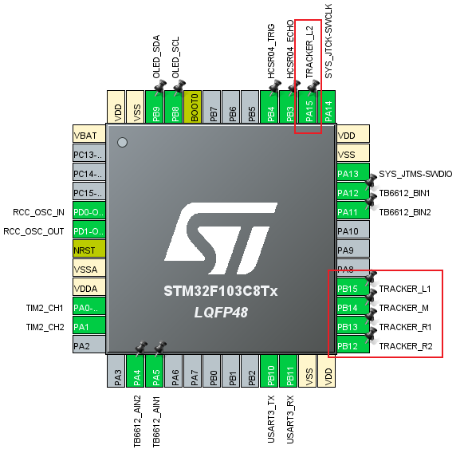

- GPIO Pull-up/Pull-down：根据传感器输出特性选择 **No pull-up and no pull-down** 或 **Pull-Down**

- User Label 分别设置为 **TRACKER_R2**、**TRACKER_R1**、**TRACKER_M**、**TRACKER_L1**、**TRACKER_L2**

  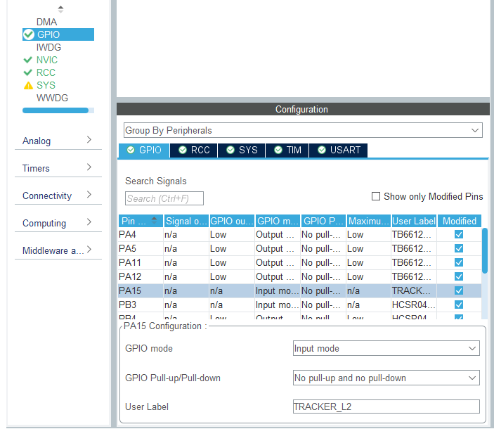

#### config.h 配置

```c
// 使能 Tracker 模块
#define DEVICE_TRACKER  1
#if DEVICE_TRACKER
    #include "gpio.h"
    // 五路循迹引脚读取宏（CubeMX 生成的引脚名称）
    #define L2  HAL_GPIO_ReadPin(TRACKER_L2_GPIO_Port, TRACKER_L2_Pin)
    #define L1  HAL_GPIO_ReadPin(TRACKER_L1_GPIO_Port, TRACKER_L1_Pin)
    #define M   HAL_GPIO_ReadPin(TRACKER_M_GPIO_Port,  TRACKER_M_Pin)
    #define R1  HAL_GPIO_ReadPin(TRACKER_R1_GPIO_Port, TRACKER_R1_Pin)
    #define R2  HAL_GPIO_ReadPin(TRACKER_R2_GPIO_Port, TRACKER_R2_Pin)
#endif
```

#### API 接口

```c
int16_t Tracker_Read(void);  // 读取五路循迹偏差值
```

#### 使用示例

```c
#include "Tracker.h"
#include "TB6612.h"
#include "OLED.h"

int16_t error = 0;
uint8_t flag = 0;

int main(void)
{
    TB6612_Init();

    OLED_Init();
    OLED_Clear();
    OLED_ShowString(1, 1, "Tracker Test");
    OLED_ShowString(2, 1, "Err:");
    OLED_ShowString(3, 1, "State:");

    while (1)
    {
        error = Tracker_Read();
        OLED_ShowSignedFloat(2, 6, error, 1);

        if (error == -4)
        {
          // 非阻塞直角左转
          flag = 1;
        }
        else if (error == 4)
        {
          // 非阻塞直角右转
          flag = 2;
        }
        else if (error == 0)
        {
          // 检测到回到中线退出直角转弯
          flag = 0;
        }

        if (flag == 0)
        {
          // 非直角，普通转弯，比例控制循迹
          OLED_ShowString(3, 7, "Track");
          TB6612_Motor(1000 + error * 100, 1000 - error * 100);
        }
        else if (flag == 1)
        {
          // 直角处理：原地左转
          OLED_ShowString(3, 7, "TurnL");
          TB6612_Motor(-1500, 1500);
        }
        else if (flag == 2)
        {
          // 直角处理：原地右转
          OLED_ShowString(3, 7, "TurnR");
          TB6612_Motor(1500, -1500);
        }
    }
}
```

---

## 📧 联系方式

- 🐧：2103539430

- 🛰：Ubuntu_Noble
